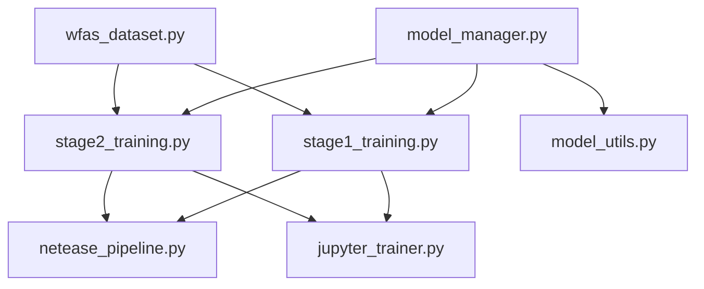

# Complete NetEase Anti-Spoofing Project Structure

## 📁 Project Directory Layout

```
netease_antispoofing/
├── 📄 model_manager.py          # Model loading/caching system
├── 📄 stage1_training.py        # Stage 1 training (ConvNext)
├── 📄 stage2_training.py        # Stage 2 training (MaxViT)
├── 📄 netease_pipeline.py       # Complete pipeline runner
├── 📄 jupyter_trainer.py        # Jupyter-friendly interface
├── 📄 model_utils.py           # CLI utilities for model management
├── 📄 wfas_dataset.py          # Dataset loading (you need to create this)
├── 📄 requirements.txt          # Python dependencies
├── 📄 README.md                # Project documentation
├── 📄 config_examples.json     # Example configurations
└── 📁 notebooks/               # Jupyter notebooks
    ├── 📄 quick_start.ipynb    # Getting started notebook
    ├── 📄 stage1_demo.ipynb    # Stage 1 demonstration
    ├── 📄 stage2_demo.ipynb    # Stage 2 demonstration
    └── 📄 full_pipeline.ipynb  # Complete pipeline demo
```

## 🔗 File Dependencies



## 📋 File Purposes

| File | Purpose | Dependencies | Output |
|------|---------|--------------|--------|
| `model_manager.py` | Model loading/caching system | `timm`, `torch` | Cached models |
| `stage1_training.py` | ConvNext training | `model_manager`, `wfas_dataset` | Soft labels |
| `stage2_training.py` | MaxViT training | `model_manager`, `wfas_dataset` | Final model |
| `netease_pipeline.py` | CLI pipeline runner | `stage1_training`, `stage2_training` | Complete results |
| `jupyter_trainer.py` | Jupyter interface | `stage1_training`, `stage2_training` | Interactive training |
| `model_utils.py` | Model management CLI | `model_manager` | Utility operations |
| `wfas_dataset.py` | Dataset handling | `torch`, `PIL` | Data loaders |

## 🚀 Usage Examples

### 1. Command Line Usage

```bash
# Complete pipeline
python netease_pipeline.py --data_root /path/to/WFAS --output_dir ./experiment

# Stage 1 only
python netease_pipeline.py --data_root /path/to/WFAS --stage1_only

# Stage 2 only (with existing soft labels)
python netease_pipeline.py --data_root /path/to/WFAS --stage2_only --soft_labels_path ./soft_labels.pth

# Model management
python model_utils.py list
python model_utils.py download stage1 convnext_base
python model_utils.py clear --stage stage1
```

### 2. Jupyter Notebook Usage

```python
from jupyter_trainer import JupyterNeteaseTrainer

# Initialize trainer
trainer = JupyterNeteaseTrainer(data_root="/path/to/WFAS")

# Quick complete pipeline
results = trainer.train_complete_pipeline(
    stage1_epochs=20,
    stage2_epochs=15,
    batch_size=16
)

# Or train stages separately
soft_labels = trainer.train_stage1(epochs=20)
test_acc, test_acer = trainer.train_stage2(soft_labels, epochs=15)
```

### 3. Direct Python Usage

```python
from stage1_training import Stage1Trainer
from stage2_training import Stage2Trainer

# Stage 1
config1 = {...}  # Your config
trainer1 = Stage1Trainer(config1)
soft_labels_path = trainer1.train()

# Stage 2
config2 = {...}  # Your config with soft_labels_path
trainer2 = Stage2Trainer(config2)
test_acc, test_acer = trainer2.train()
```

## ⚙️ Configuration System

### Stage 1 Configuration
```json
{
  "data_root": "/path/to/WFAS",
  "model_name": "convnext_base",
  "pretrained": true,
  "num_epochs": 50,
  "batch_size": 32,
  "learning_rate": 2e-4,
  "model_cache_dir": "./model"
}
```

### Stage 2 Configuration
```json
{
  "data_root": "/path/to/WFAS",
  "soft_labels_path": "./outputs/stage1_soft_labels.pth",
  "model_name": "maxvit_base_tf_224",
  "num_epochs": 30,
  "batch_size": 32,
  "learning_rate": 1e-4,
  "focal_weight": 1.0,
  "triplet_weight": 0.5,
  "kd_weight": 1.0
}
```

## 📊 Output Structure

```
experiment_output/
├── 📁 checkpoints/
│   ├── 📁 stage1/
│   │   ├── stage1_best.pth
│   │   └── stage1_latest.pth
│   └── 📁 stage2/
│       ├── stage2_best.pth
│       └── stage2_latest.pth
├── 📁 logs/
│   ├── 📁 stage1/
│   │   └── stage1_training_20241224_120000.log
│   └── 📁 stage2/
│       └── stage2_training_20241224_130000.log
├── 📁 model/
│   ├── 📁 stage1/
│   │   └── 📁 convnext_base/
│   └── 📁 stage2/
│       └── 📁 maxvit_base_tf_224/
├── 📄 stage1_config.json
├── 📄 stage2_config.json
├── 📄 stage1_soft_labels.pth
├── 📄 final_results.json
└── 📄 experiment_info.json
```

## 🔧 Integration Points

### Model Manager Integration
- Both training scripts use `ModelManager` for model loading
- Automatic model caching and downloading
- Consistent model handling across stages

### Dataset Integration
```python
# In wfas_dataset.py (you need to implement this)
def create_dataloaders_with_debug(data_root, stage, **kwargs):
    # Your dataset loading logic
    return train_loader, val_loader, test_loader
```

### Soft Label Flow
1. Stage 1 generates: `stage1_soft_labels.pth`
2. Stage 2 consumes: Uses soft labels for knowledge distillation
3. Format: `{image_path: [prob_spoof, prob_live], ...}`

## 🎯 Key Features

### 1. Modularity
- Each component can be used independently
- Clear separation of concerns
- Easy to extend or modify

### 2. Flexibility
- Multiple interfaces (CLI, Jupyter, Python)
- Configurable hyperparameters
- Stage-wise or complete pipeline execution

### 3. Robustness
- Automatic model caching
- Error handling and fallbacks
- Progress tracking and visualization

### 4. Reproducibility
- All configurations saved
- Experiment tracking
- Deterministic model loading

## 📦 Dependencies (requirements.txt)

```txt
torch>=1.9.0
torchvision>=0.10.0
timm>=0.6.0
numpy>=1.21.0
pandas>=1.3.0
matplotlib>=3.4.0
tqdm>=4.62.0
Pillow>=8.3.0
jupyter>=1.0.0
ipywidgets>=7.6.0
safetensors>=0.3.0
```

## 🚀 Quick Start

1. **Install dependencies:**
   ```bash
   pip install -r requirements.txt
   ```

2. **Prepare dataset:**
   - Implement `wfas_dataset.py` for your data format
   - Ensure proper directory structure

3. **Run complete pipeline:**
   ```bash
   python netease_pipeline.py --data_root /path/to/data
   ```

4. **Or use Jupyter:**
   ```python
   from jupyter_trainer import quick_train_complete
   results = quick_train_complete("/path/to/data")
   ```

This structure provides a complete, modular, and user-friendly system for NetEase anti-spoofing training! 🎉